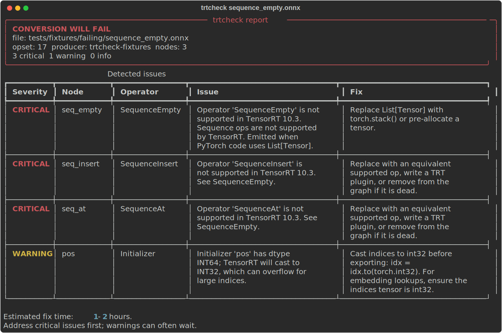

# trtcheck

[](https://github.com/sohams25/trtcheck/actions/workflows/ci.yml)
[](https://pypi.org/project/trtcheck/)
[](https://www.python.org/)
[](LICENSE)

Static pre-flight checker for ONNX to TensorRT conversion.

`trtcheck` reads an ONNX file, runs five independent checkers against it, and
tells you in seconds whether the model will convert cleanly to a TensorRT
engine. If it won't, the report explains what to fix. It runs anywhere
Python runs: no TensorRT, no CUDA driver, no GPU required.



## Why

The PyTorch -> ONNX -> TensorRT pipeline fails most of the time on the last
hop. The errors are cryptic and the iteration loop ("export, wait two
minutes, read a C++ traceback, google, try again") burns hours per fix.

`trtcheck` predicts the failure modes locally so you can correct them
before invoking `trtexec`.

## Install

```bash
pip install trtcheck
```

Or from source:

```bash
git clone https://github.com/sohams25/trtcheck.git
cd trtcheck
pip install -e ".[dev]"
```

Requires Python 3.10+.

## Usage

```bash
# Basic check (defaults to TensorRT 10.3)
trtcheck model.onnx

# Target a specific TensorRT version
trtcheck model.onnx --target-trt 8.6

# Machine-readable output for CI
trtcheck model.onnx --format json --output report.json

# Self-contained HTML report
trtcheck model.onnx --format html --output report.html

# Filter to blockers only
trtcheck model.onnx --severity critical

# Compare two versions of a model (before/after a fix)
trtcheck before.onnx after.onnx --diff

# Auto-fix simple issues (INT64 indices, UINT8 inputs followed by Cast)
trtcheck model.onnx --fix --dry-run --output model_fixed.onnx
trtcheck model.onnx --fix --output model_fixed.onnx
```

Exit code is `1` if conversion is unlikely to succeed, `0` otherwise. Wire
that into CI to catch regressions at PR time.

## What it checks

| Checker            | Catches |
|--------------------|---------|
| operator support   | Ops missing or partial in the target TRT version (e.g. `SequenceEmpty`, `GroupNormalization` on TRT 8.x) |
| precision          | UINT8/FLOAT64/STRING inputs, INT64 weights, BF16 on older targets |
| dynamic shapes     | Multiple symbolic dims on inputs |
| control flow       | `Loop` with runtime trip count, nested `Loop`, `If`, `Scan` |
| graph structure    | Empty outputs, duplicate node names, oversized constants |

Each finding includes a specific remediation, not just "this is bad."

## How the operator matrix is maintained

The TRT-version-to-operator support table lives in
`trtcheck/data/operator_matrix.json` and is hand curated. To refresh it for
a new TensorRT release:

1. Edit `tools/build_operator_matrix.py` (the source of truth).
2. Run `python tools/build_operator_matrix.py` to regenerate the JSON.
3. Run the test suite: `pytest tests/test_data_files.py -v`.
4. Commit both the script change and the regenerated JSON.

## Development

```bash
# Set up
python -m venv .venv
source .venv/bin/activate
pip install -e ".[dev]"

# Tests
./scripts/run-tests.sh

# Type check
mypy trtcheck/

# Format
black . && isort .
```

If you contribute a new checker, follow the TDD cycle: write the test
first, confirm it fails, then implement. See `CLAUDE.md` for the full
project conventions.

## Roadmap

- HTML diff view with side-by-side columns.
- Quarterly refresh tooling driven by NVIDIA release notes.

See [CHANGELOG.md](CHANGELOG.md) for release notes.

## License

MIT. See [LICENSE](LICENSE).
