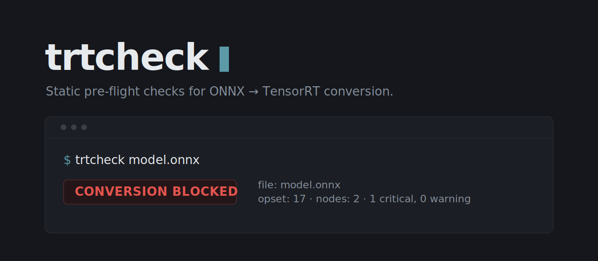

<p align="center">
  
</p>

<p align="center">
  <a href="https://github.com/sohams25/trtcheck/actions/workflows/ci.yml"></a>
  <a href="https://pypi.org/project/trtcheck/">                                              </a>
  <a href="https://www.python.org/">                                                         </a>
  <a href="LICENSE">                                                                         </a>
</p>

**Catch ONNX → TensorRT conversion issues before engine build.**

`trtcheck` checks an ONNX model for common TensorRT conversion problems
before you build an engine. Static analysis runs without CUDA, TensorRT,
or a GPU and explains each finding with a suggested next step. A small
set of model fixes can be applied safely, and when `trtexec` is
available, the same CLI can verify the model through a real TensorRT
engine build.

Static analysis identifies known problems, but it cannot guarantee that
every model will build. Only a successful runtime check produces the
`verified` verdict.

<p align="center">
  
</p>

## Install

```bash
pip install trtcheck
```

Or from source for development:

```bash
git clone https://github.com/sohams25/trtcheck.git
cd trtcheck
pip install -e ".[dev]"
```

Python 3.10–3.13, `onnx >= 1.15, < 2.0`. No platform dependencies beyond
`onnx` itself — analysis needs no TensorRT, no GPU. Modeled TensorRT
targets: 8.0, 8.6, 10.0, 10.3; each operator entry carries its own
evidence level (official documentation, inferred, or unknown — see
[`docs/rules.md`](docs/rules.md) and the operator pages).

## Quick start

```bash
pip install trtcheck

# Static analysis — TensorRT and a GPU are not required
trtcheck model.onnx

# Real engine-build verification when trtexec is available
trtcheck model.onnx --verify-runtime
```

```
CONVERSION BLOCKED — 1 critical, 0 warning
CRITICAL  input  Input  Input 'input' has dtype UINT8; TensorRT
                        accepts only FP32, FP16, INT32, or INT8
                        as graph inputs.
                        → Move the UINT8 → FLOAT32 conversion (and
                          normalization) into your preprocessing
                          pipeline rather than the model body.

Estimated fix time: 15–30 minutes.
```

Machine-readable output for CI:

```bash
trtcheck model.onnx --format json --output report.json
```

## The four verdicts

| Verdict | Meaning |
|---|---|
| `blocked` | A known critical incompatibility was found. |
| `unverified` | The result depends on something static analysis cannot confirm: an unknown operator, a custom-domain op that needs a TensorRT plugin, or a condition only runtime can settle. |
| `likely` | Static analysis found no known blocker, but no real TensorRT build was performed. |
| `verified` | A real `trtexec` parser/build verification succeeded. |

Four rules keep these honest:

- static analysis alone never returns `verified`;
- unknown and custom-domain operators do not silently pass — they make
  the verdict `unverified`;
- a runtime parser or build failure cannot remain `likely`;
- `verified` applies to the exact model, configuration, and TensorRT
  environment that was tested.

The exit code is `1` on `blocked` and `0` otherwise; `--fail-on
unverified` tightens the CI gate to also fail on unresolved conditions.
[`docs/case-studies/uint8-input.md`](docs/case-studies/uint8-input.md)
walks the UINT8 case above end to end, including the `--fix` rewrite
that turns it into a passing graph.

## Motivation

`trtexec` reports conversion problems at engine build time, one at a
time, as C++ log output. Some common failures and what they trace back
to:

| `trtexec` error | Actually means | Root cause |
|---|---|---|
| `UNSUPPORTED_NODE: SequenceEmpty` | Your model contains an ONNX sequence op | PyTorch `List[Tensor] = []` in `forward()` |
| `Assertion failed: convert_dtype: UINT8` | Graph input dtype is `uint8` | Image preprocessing with `np.uint8` |
| `at least 5 dimensions are required` | `MaxPool` sees a tensor that lost rank after shape inference | Dynamic batch combined with `reshape` |
| `INT64 weights detected … not natively supported` | A `Constant` or `Initializer` is `int64` | `torch.LongTensor` for argmax / indices |
| `Network must have at least one output` | Shape inference removed every output | `If` / `Loop` with dynamic shape |

trtcheck runs the equivalent compatibility checks statically, so every
issue in the model surfaces in one pass, as a named finding with a
fix, before an engine build is attempted.

## What it checks

| Checker | Catches |
|---|---|
| **operator support** | Ops missing or partial in the target TRT version (e.g. `SequenceEmpty`, `GroupNormalization` on TRT 8.x); documented conditional-support rules (e.g. TopK `sorted=0`, cubic `Resize`); honest `unverified` findings for operators the matrix does not classify and for custom-domain ops that need a TRT plugin |
| **precision** | `UINT8` / `INT64` / `FLOAT64` / `STRING` / `BFLOAT16` graph inputs, `INT64` weights, and `FLOAT64` introduced by a `Cast` or `Constant` anywhere in the graph |
| **dynamic shapes** | Two or more symbolic input dims, including dynamic dims encoded as a concrete `-1` |
| **control flow** | `Loop` with runtime trip count, nested `Loop`, `If`, `Scan` |
| **graph structure** | Empty outputs, duplicate node names, oversized constants |

Every check descends into `If` / `Loop` / `Scan` **subgraph bodies** — an
unsupported op buried in a branch is caught, not waved through. Each finding
includes a specific remediation. Not "this is bad" — what to change, where.

## What it auto-fixes

`--fix` analyzes the original model, applies only validated
transformations, validates the candidate, then re-analyzes it against
the same TensorRT target and reports which findings were resolved,
which remain, and whether any were introduced. Not every finding has an
automatic fix, and a fixed model is still a static result — it does not
imply runtime verification.

Each fixer runs transactionally on an isolated model copy. A crashing
plugin, an invalid transformation, or a fixer that claims a change
without making one is rejected without modifying the committed model.

| Fixer | Rewrites |
|---|---|
| **`uint8_input`** | Promotes a `UINT8` graph input to `FLOAT` and drops the redundant downstream `Cast` |
| **`int64_to_int32`** | INT64 initializers are converted only when their values fit in INT32 and every consumer position safely accepts INT32. Inputs that require INT64 by schema, such as the shape input of `Reshape`, are left unchanged |
| **`float64_to_float32`** | Casts `FLOAT64` initializers to `FLOAT32` when no value is NaN, infinite, or out of FP32 range |
| **`drop_dropout`** | Dropout is removed only when inference behavior is provable. A node is left unchanged when training mode is active or unresolved, or when removing it could alter an observed output |
| **`upsample_to_resize`** | Rewrites leftover deprecated `Upsample` nodes as `Resize` on opset-13+ graphs (nearest / linear) |

```bash
trtcheck model.onnx --fix --dry-run                    # preview
trtcheck model.onnx --fix --output fixed.onnx          # apply
```

Refuses to overwrite the input or an existing output unless you pass
`--force`. The exact rules and invariants live in
[`docs/fixers.md`](docs/fixers.md) and
[`docs/design/analysis-verdicts-and-fix-safety.md`](docs/design/analysis-verdicts-and-fix-safety.md).

## Measured accuracy

The [`bench/`](bench/) harness scores trtcheck's verdicts against a
corpus with known conversion outcomes. Latest run against the TRT 10.3
matrix:

| Corpus | Blocker precision | Blocker recall | Unverified coverage | Total wall time |
|---|---|---|---|---|
| 12 models: 3 from the ONNX Model Zoo, 9 bundled fixtures | 1.000 | 1.000 | 0.250 | 2.3 s |

`unverified` predictions are never counted as successes — they are
reported separately, split by ground truth. Twelve models is a small
corpus and the failure cases are synthetic, so read this as "the checks
do what they claim on known patterns", not as a field-accuracy estimate.
For the scorecard corpus, ground truth is documented TRT behavior, not a
live `trtexec` run.
[`docs/evidence/scorecard.md`](docs/evidence/scorecard.md) has the per-model table, the methodology,
and what each run caught (the first run's false negative became the
`loop_runtime_trip_count` critical check; this run exposed a `Clip`
coverage gap in the matrix). To grow the corpus, add a model with a
known outcome to [`bench/manifest.yaml`](bench/manifest.yaml) and open a
PR.

### Runtime smoke validation

The runtime-verification integration was tested using TensorRT 10.3.0 on
seven bounded generated or public fixtures. Five models built
successfully, and two expected models failed during parsing. `trtcheck`
agreed with direct `trtexec` in all seven cases.

This validates the runtime-verification path and those test cases. It
does not establish universal compatibility across models, plugins,
hardware, TensorRT versions, or builder configurations.

One observation worth knowing: on TensorRT 10.3, `trtexec` may
automatically build a degenerate profile for a dynamic model when
explicit shape flags are omitted. The static missing-profile finding
remains useful because production profiles should be supplied
deliberately.

Full commands, environment details, and per-model results:
[`docs/evidence/tensorrt-10.3-smoke.md`](docs/evidence/tensorrt-10.3-smoke.md).

## How it compares

| | trtcheck | [Polygraphy](https://github.com/NVIDIA/TensorRT/tree/main/tools/Polygraphy) | [Netron](https://github.com/lutzroeder/netron) |
|---|---|---|---|
| Needs TensorRT / GPU | no | yes, for conversion checks | no |
| Time to a verdict | seconds | minutes (builds a real engine) | manual inspection |
| Fix suggestions | per-finding remediation + `--fix` rewrites | no | no |
| CI integration | exit code, JSON, GitHub Action | scriptable, needs a GPU runner | no |
| Verdict strength | static analysis returns `blocked`, `unverified`, or `likely`; optional runtime verification can return `verified` after a successful real TensorRT build | proves it (builds a real engine) | n/a |

Use them together. Polygraphy building an engine is the ground truth;
if you have the GPU and the minutes, run it. Netron is for eyeballing
a graph once you know which node to look at. trtcheck is the
ten-second gate that runs before either: on a laptop, in CI, on every
PR.

## Usage

```bash
# basic check (defaults to TensorRT 10.3)
trtcheck model.onnx

# target a specific TensorRT version
trtcheck model.onnx --target-trt 8.6

# machine-readable output for CI
trtcheck model.onnx --format json --output report.json

# self-contained HTML report
trtcheck model.onnx --format html --output report.html

# filter to blockers only
trtcheck model.onnx --severity critical

# compare two versions of a model (before / after a fix)
trtcheck before.onnx after.onnx --diff

# auto-fix simple issues (transactional; reports resolved/remaining findings)
trtcheck model.onnx --fix --output model_fixed.onnx

# strict CI gate: also fail on unresolved conditions
trtcheck model.onnx --fail-on unverified

# optional: verify with a real TensorRT build (needs trtexec)
trtcheck model.onnx --verify-runtime
```

JSON reports use schema **2.0**: each finding carries a stable `rule_id`
(`TRT-OP-UNSUPPORTED`, `TRT-DTYPE-UINT8-INPUT`, ...), a `confidence`
level, and a `verify_required` flag; plugin findings without their own id
get a namespaced `PLUGIN-<name>` fallback. Every 1.x key is still
emitted, so existing consumers keep working. Field-by-field reference and
the full rule registry: [`docs/usage.md`](docs/usage.md) and
[`docs/rules.md`](docs/rules.md).

Full CLI reference: `trtcheck --help`.

## Use it as a GitHub Action

Ships a composite Action that runs on PRs touching `*.onnx` files and
posts a sticky comment summarizing the report. The dual-workflow
pattern (analyze on PR head with read-only token, comment from base
repo with write token) keeps fork PRs safe.

`.github/workflows/trtcheck.yml`:

```yaml
name: trtcheck
on:
  pull_request:
    paths: ["**/*.onnx"]
permissions:
  contents: read
jobs:
  analyze:
    runs-on: ubuntu-latest
    steps:
      - uses: actions/checkout@v4
        with: { fetch-depth: 0 }
      - id: trtcheck
        uses: sohams25/trtcheck@v1.1.0
        with:
          target-trt: "10.3"
          fail-on: "critical"
      - if: always()
        run: |
          mkdir -p comment-artifact
          cp "${{ steps.trtcheck.outputs.comment-md }}" comment-artifact/body.md
          echo "${{ github.event.pull_request.number }}" > comment-artifact/pr-number.txt
      - if: always()
        uses: actions/upload-artifact@v4
        with: { name: trtcheck-comment, path: comment-artifact/ }
```

Pair with `trtcheck-comment.yml` to post the comment from the base
repo. Full template at
[`.github/workflows/example-consumer/trtcheck-comment.yml`](.github/workflows/example-consumer/trtcheck-comment.yml).

### Action inputs

| Input | Default | Purpose |
|---|---|---|
| `version` | `1.1.0` | trtcheck PyPI version to install |
| `target-trt` | `10.3` | `--target-trt` value |
| `severity` | `warning` | `--severity` filter |
| `fail-on` | `critical` | Exit policy: `critical`, `warning`, or `never` |
| `paths` | `**/*.onnx` | Glob of files to consider |
| `changed-only` | `true` | Only analyze PR-changed files |
| `base-ref` | (PR base sha) | Base ref to diff against when `changed-only` is set |
| `source-path` | (unset) | Install trtcheck from a local path instead of PyPI; used by the selftest workflow |

### Action outputs

`report-json`, `comment-md`, `critical-count`, `warning-count`,
`status` (`pass` / `fail`).

## Plugins

Third-party packages can ship checkers, fixers, and reporters via
Python entry-points:

```toml
[project.entry-points."trtcheck.fixers"]
strip_identity = "your_package.fixers:StripIdentityFixer"
```

The Protocols live in `trtcheck.plugins`. Worked example at
[`examples/trtcheck-extra-fixers/`](examples/trtcheck-extra-fixers/).
Confirm a plugin loaded with `trtcheck --list-plugins`; filter one out
without uninstalling with `trtcheck --disable-plugin NAME`.

Full surface at
[`docs/design/plugin-sdk.md`](docs/design/plugin-sdk.md). The public
extension API was frozen at v1.0 and follows semver from here.

## The operator matrix

`trtcheck/data/operator_matrix.json` is a hand-curated mapping from
ONNX operators to their support status across TRT 8.0, 8.6, 10.0, and
10.3. Refresh recipe:

```bash
# edit the generator
$EDITOR tools/build_operator_matrix.py

# regenerate the JSON
python tools/build_operator_matrix.py

# validate
pytest tests/test_data_files.py -v

# detect drift against the upstream onnx-tensorrt operators table
python tools/check_matrix_drift.py
```

Run the drift check before each release to keep the matrix honest.

## Contributing

```bash
python -m venv .venv && source .venv/bin/activate
pip install -e ".[dev]"

./scripts/run-tests.sh        # full pytest suite
mypy trtcheck/                # strict type check
black . && isort .            # format
```

TDD is mandatory for new checkers, fixers, and reporters. The full
contribution guide — TDD cycle, operator-matrix refresh recipe, plugin
authoring layout — lives in [`CONTRIBUTING.md`](CONTRIBUTING.md).
Security disclosures: [`SECURITY.md`](SECURITY.md).

## Roadmap

- Evidence-backed support entries for additional TensorRT targets as
  they appear in the upstream operator table.
- Broader conditional-support rules (more operators with documented
  attribute/input restrictions, beyond TopK and Resize).
- More public validation fixtures — real user-reported compatibility
  cases are especially welcome.
- Extend the real-runtime smoke to further TensorRT versions when a
  matching official container and a repo-supported target exist.

The weekly [matrix-drift Action](.github/workflows/matrix-drift.yml)
files a tracking issue when the upstream operator table moves. See
[`CHANGELOG.md`](CHANGELOG.md) for release notes.

## Citation

If trtcheck saves your project some GPU hours, a citation is welcome:

```bibtex
@misc{trtcheck,
  title  = {trtcheck: a static pre-flight checker for ONNX to TensorRT conversion},
  author = {Soham},
  year   = {2026},
  url    = {https://github.com/sohams25/trtcheck}
}
```

Using it in CI? Open a PR adding your project to this section.

## License

MIT. See [`LICENSE`](LICENSE).
